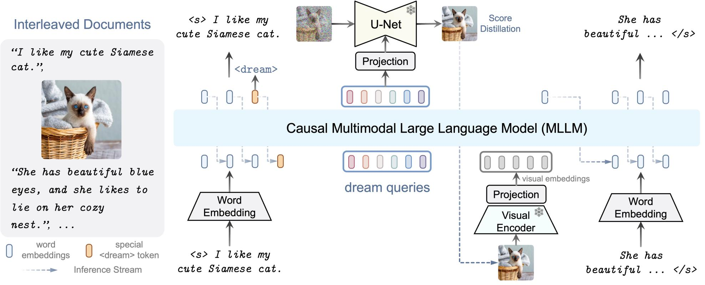

<div align="center">


</div>

<div align="center">

### ICLR 2024 (Spotlight)

## <a href="https://openreview.net/forum?id=y01KGvd9Bw">DreamLLM: Synergistic Multimodal Comprehension and Creation</a>

[Runpei Dong](https://runpeidong.github.io/), [Chunrui Han](), [Yuang Peng](https://yuangpeng.com/), [Zekun Qi](https://qizekun.github.io/), [Zheng Ge](https://joker316701882.github.io/), [Jinrong Yang](https://yancie-yjr.github.io/), [Liang Zhao](https://scholar.google.com/citations?user=uJJ5zskAAAAJ&hl=en), [Jianjian Sun](https://scholar.google.com/citations?user=MVZrGkYAAAAJ&hl=en), [Hongyu Zhou](https://scholar.google.com/citations?user=i1PB3cEAAAAJ&hl=en), [Haoran Wei](https://scholar.google.com/citations?user=J4naK0MAAAAJ&hl=en), [Xiangwen Kong](), [Xiangyu Zhang](https://scholar.google.com/citations?user=yuB-cfoAAAAJ&hl=en), [Kaisheng Ma](http://group.iiis.tsinghua.edu.cn/~maks/leader.html) and [Li Yi](https://ericyi.github.io)
</div>

[](https://dreamllm.github.io/)
[](https://openreview.net/pdf?id=y01KGvd9Bw)
[](https://huggingface.co/collections/RunpeiDong/dreamllm-65fa8297e12a435e55e4b5ca)
[](https://github.com/RunpeiDong/ChatDreamer-Private/blob/master/LICENSE)

# Introduction
DreamLLM is a learning framework that first achieves versatile Multimodal Large Language Models (MLLMs) empowered with frequently overlooked synergy between multimodal comprehension and creation. DreamLLM operates on two fundamental principles. The first focuses on the generative modeling of both language and image posteriors by direct sampling in the raw multimodal space. Second, DreamLLM fosters the generation of raw, interleaved documents, modeling both text and image contents, along with unstructured layouts. DreamLLM is a zero-shot multimodal generalist capable of both comprehension and creation.




# ♾️ Omni Framework
We introduce our framework ♾️ **Omni** to facilitate the Multimodal Large Language Models (MLLM) research. ♾️ **Omni** can be used for building new MLLMs, such as DreamLLM, supporting rapid and flexible implementation and extension.

## Changelog
All major changes are recorded at [CHANGELOG](./CHANGELOG.md).


## Installation

We have an easy-to-use installation script, `install.sh`. Just run the command `bash install.sh --help` to see the usage.

```bash
Usage: install.sh --env_name=ENV_NAME --py_ver=PY_VER --cuda=CUDA --torch_dir=TORCH_DIR
Example: install.sh --env_name=omni --py_ver=3.10 --cuda=118 --torch_dir=/data/torch-2.1.2/
        --env_name: conda environment name, the default name is `omni`
        --py_ver: python version, default version is 3.10
        --cuda: cuda version, used to install Pytorch, the default version is 118
        --torch_dir: directory address containing torch whl, if specified, the cuda version will be ignored
        -h or --help: show help information
```

**Some installation suggestions**

- We recommend creating a new environment for your project. You can specify the `--env_name` parameter to create a new environment, and the default name is `dreamllm`.
- If you have torch whl files, you can specify the `--torch_dir` parameter to install Pytorch. Otherwise, the script will automatically (from `--index-url https://download.pytorch.org/whl/cu$CUDA`) download the corresponding Pytorch version according to the `--cuda` parameter.

## Omni Principle for MLLM Architectures
In ♾️ **Omni**, the multimodal LLMs (MLLMs) are generally viewed as **LLMs** with other encoder/decoder **plugin modules**, connected with **projectors**. For example, DreamLLM consists of two main parts: LLM and the plugin vision encoder and diffusion decoder. ♾️ **Omni** implements this MLLM by viewing the LLM as the base model, and the vision encoder and SD decoder are implemented as plugin modules.
- **Base: LLM.** The LLMs are the base model, which can be different architectures such as [Vicuna](https://lmsys.org/blog/2023-03-30-vicuna/).
- **Plugin: Multimodal encoder & decoder.** The multimodal encoder are models that encode images/3D point clouds or other modalities into visual representations, such as [CLIP](https://openai.com/research/clip), [SAM](https://segment-anything.com/), or [ReCon++](https://qizekun.github.io/shapellm/). The vision decoder is the diffusion generative models, such as text-to-images models like [Stable Diffusion](https://huggingface.co/stabilityai/stable-diffusion-2-1) or [SDXL](https://huggingface.co/docs/diffusers/en/using-diffusers/sdxl).
- **Connector: Projectors.** The projector is used for representation projection to connect the LLM base model with the plugin models. The projector could be linear, MLP, Q-Former, or convolutional neural networks. See `omni/models/projector`.

## Quick Start (How to use?)

### Define model files

If we want to create a new project based on `llama`, say called `dreamllm`, we first need to define its model file under `omni/models/dreamllm`.

- `configuration_dreamllm.py` inherits from `transformers.configuration_utils.PretrainedConfig`, and the exact definition can be found in `omni/models/dreamllm/configuration_dreamllm.py`, where it contains all parameters defined by the model, as well as some parameters that can simplify the writing of training scripts and inference scripts. **Please note that we should rewrite `model_type = "dreamllm"`.**
- `modeling_dreamllm.py` includes the complete model definition for the `dreamllm` project, where we use `DreamLLMDecoderLayer` and `DreamLLMRMSNorm` to build our model.
  - `DreamLLMPreTrainedModel` inherits from `transformers.PreTrainedModel`, with the change of `config_class=DreamLLMConfig`, where `DreamLLMConfig` is defined in `configuration_dreamllm.py`.
  - Why do we explicitly define the `BaseModelOutputWithPast` and `CausalLMOutputWithPast`? Because we need to add the returned parameters. And `additional_log_info` can work with `Trainer` to record extra info to `wandb`.
  - The model structure is then defined in the `DreamLLMModel.__init__` and `DreamLLMForCausalLM.__init__` functions, the logic for forward propagation is defined in the `DreamLLMModel.forward` function, and the logic for calculating the `loss` is defined in `DreamLLMForCausalLM.forward` in `DreamLLMForCausalLM.forward`. You can also modify `DreamLLMForCausalLM.from_pretrain` to load model pretrained weights more customized.
  - The logic for model saving is in the `save_model` and `_save` functions in `omni/train/trainer.py`. You can modify these two functions to create a more customized saving process.

### Define dataset builder

Define the dataset of `dreamllm` in `omni/data/builders/builder_dreamllm.py`. You can use `omni.data.constants.DataManager` to build your project dataset quickly.

All dataset meta information is recorded at `omni/data/constants.py`

The supported datasets now include:

```shell
--------------------------------------------------------------------------------------------------------------------
| Dataset Name                    | Size    | Description                                                          |
|------------------------------------------------------------------------------------------------------------------|
| laion_coco                      | 104.9M  | Captioned 600M images from the english subset of Laion-5B with a ... |
| laion2b_en                      | 2.0B    | Laion 5B project, 2.32 billion of these contain texts in the Eng ... |
| laion400m                       | 270.0M  | The data is complete 400M, considering the packet loss problem m ... |
| blip_laion                      | 65.0M   | 115M images whose shorter edge is larger than 256 pixels from th ... |
| journeydb                       | 2.4M    | 4M high-resolution Midjourney images, but we only download 2M. M ... |
| pokemon-gpt4-captions           | 833     | This dataset is just lambdalabs/pokemon-blip-captions but the ca ... |
| dalle3-by-laion                 | 13.0K   | This dataset consists of prompt and image URL pairs scraped from ... |
| mmc4_core                       | 7.0M    | The interleaved MMC4-core dataset.                               ... |
| obelics                         | 113.0M  | The interleaved Obelics dataset.                                 ... |
| webvid                          | 10.7M   | Large-scale text-video dataset, containing 10 million video-text ... |
| llava_pretrain                  | 558.0K  | 558K unique language-image instruction-following samples for ima ... |
| gqa                             | 13.5M   | GQA dataset.                                                     ... |
| llava_instruct                  | 158.0K  | 158K unique language-image instruction-following samples in tota ... |
| llava_instruct_filter           | 80.0K   | llava_instruct_158K filtered to 80K samples.                     ... |
| llavav1.5_instruct              | 158.0K  | 665K unique language-image instruction-following samples in tota ... |
--------------------------------------------------------------------------------------------------------------------
```

An example of using `DataManager`:

```python
from omni.data.constants import DataManager
data = DataManager(
    datasets=["laion2b_en", "journeydb"],
    datasets_init_kwargs={"min_size": 64},
    size_list=["10M", "20M"],
)
sample = data.__getitem__(0)
```

### Define training scripts
The training scripts and config files of each project is defined at an individual folder under `projects`. For example, DreamLLM is defined as `projects/dreamllm`.

The training script of DreamLLM is `projects/dreamllm/train.py`, the definition of a project should be implemented in the following steps:

- Define your training arguments in the following way:

  ```python
  from omni.train.training_args import TrainingArguments
  
  @dataclass
  class ModelArguments:
      model_name_or_path: str | None = field(default="lmsys/vicuna-13b-delta-v0")
      vq_model_name_or_path: str | None = field(default="openMUSE/maskgit-vqgan-imagenet-f16-256")
      vision_vocab_size: int | None = field(default=8192)
      model_max_length: int = field(
          default=2048, metadata={"help": "Maximum sequence length. Sequences will be right padded (and possibly truncated)."}
      )
      # ...


  @dataclass
  class DataArguments:
      datasets: list[str] = field(default_factory=list, metadata={"help": "Which datasets are used? (default: [])"})
      datasets_init_kwargs: dict = field(default_factory=dict, metadata={"help": "The init kwargs of datasets."})
      size_list: list[str | int] = field(default_factory=list, metadata={"help": "The size of each dataset."})
      # ...


  @dataclass
  class Arguments(LazyAguments):
      model: ModelArguments = field(default_factory=ModelArguments)
      data: DataArguments = field(default_factory=DataArguments)
      training: TrainingArguments = field(default_factory=TrainingArguments)
  ```

- Define your training main function:

  ```python
  def train(config: DataClass, *args, **kwargs):
      # define models
      # set the `requires_grad` status
      # define `data_collator`
      # define `dataset`

      # train
      trainer = Trainer(
          model=model,
          args=config.training,
          data_collator=data_collator,
          train_dataset=train_dataset,
          eval_dataset=eval_dataset,
          tokenizer=tokenizer,
      )
      if list(pathlib.Path(config.training.output_dir).glob("checkpoint-*")):
          trainer.train(resume_from_checkpoint=True)
      else:
          trainer.train()
      trainer.save_model(output_dir=config.training.output_dir)
      trainer.save_state()
  ```

- Use `LazyLaunch` to launch your function, so you can use `pyinstrument` automatically, or you can start `torch.profiler` manually.

  ```python
  if __name__ == "__main__":
      LazyLaunch(train, Arguments)
  ```

### Define project config files
The configuration system of ♾️ **Omni** is implemented based on Lazy Configs (See [what is lazy configs?](https://detectron2.readthedocs.io/en/latest/tutorials/lazyconfigs.html)).

- Define the common configuration, such as plugin modules that are shared with different training recipes. For example, define the Stable Diffusion head, Dream embedding, and CLIP vision encoders as follows.
```python
from omni.constants import MODEL_ZOOS
from omni.models.dreamllm.configuration_dreamllm import ConfigAndInitKwargs, create_config_init_kwargs
from omni.models.dreamllm.modeling_plugins import CLIPVisionEmbedding, DreamEmbedding, StableDiffusionHead
stable_diffusion_head_config_init_kwargs = create_config_init_kwargs(
    ConfigAndInitKwargs(
        _class_=StableDiffusionHead,
        _name_="stable_diffusion_head",
        _plugin_type_="head",
        projector_type="linear",
        projector_depth=1,
        diffusion_name_or_path=MODEL_ZOOS["stabilityai/stable-diffusion-2-1-base"],
        pretrained_model_name_or_path=None,
        freeze_vae=True,
        freeze_unet=True,
        freeze_projector=False,
        local_files_only=False,
    )
)
...
```

## Training
If you use `LazyLaunch` to launch your training function, you can use `torchrun` to start training scripts, and you must specify the `--config_file` parameter. If you want to modify the parameters in the config file from cli, you should follow [hydra's override rules](https://hydra.cc/docs/advanced/override_grammar/basic/).

```bash
torchrun -m projects.dreamllm.train \
--config_file projects/dreamllm/configs/stage1/base.py \
"training.per_device_train_batch_size=16" \
"training.output_dir='./work_dirs/your_dir/'" \
"training.run_name='wandb_run_name'" \
"training.learning_rate=2e-3"
```

## Meta Information
### Dataset Meta Information Registration
All the meta information is defined and saved at `omni/data/constants.py`. For example, when we try to register the image-text pair dataset `blip_laion`, the data should be registered as:
```python
from omni.config.lazy import LazyCall as L
from omni.data.datasets.unified_it_pair_webdataset import UnifiedITPairWebdataset
from omni.data.manager.data_registry import DataRegistry
from omni.data.manager.dataset_info import WebDatasetInfo
from omni.data.manager.dataset_type import DatasetType
DATASETS_INFO_TABLE = [
    L(WebDatasetInfo)(
        name="blip_laion",
        description="""115M images whose shorter edge is larger than 256 pixels from the original LAION400M. Then, use CapFilt from BLIP to filter high-quality captions.
        More details: https://github.com/salesforce/BLIP/tree/main#pre-training-datasets-download
        """,
        dataset_type=DatasetType.ImageTextPair,
        cls=UnifiedITPairWebdataset,
        approx_size="65M",
        shard_list_path="path2blip_laion_65m_shard_list.json",
    ),
]
DataManager = DataRegistry("DataManager")
DataManager.register(DATASETS_INFO_TABLE)
```
Note that when you add a new dataset, you have to define its dataset type, dataloader, and organization style. We have provided some basic support for datasets based on Webdataset and datasets that use JSON files for annotation storage.

### Model Information Registration
All the models and other meta information, such as commonly used special tokens definition, are defined at `omni/constants.py`. To accelerate the usage with pretrained models on your local machine (i.e., `local_files_only` in Huggingface), please modify this meta information by changing the `MODEL_ZOOS`.
```python
# set the path according to your local machine
MODEL_ZOOS = {
    "decapoda-research/llama-7b-hf"           : "huggingface_cache/hub/models--decapoda-research--llama-7b-hf/snapshots/5f98eefcc80e437ef68d457ad7bf167c2c6a1348",
    "meta-llama/Llama-2-7b-chat-hf"           : "huggingface_cache/hub/llama2-7b-chat",
    "meta-llama/Llama-2-70b-chat-hf"          : "huggingface_cache/hub/models--meta-llama--Llama-2-70b-hf",
    "lmsys/vicuna-7b-v1.1"                    : "huggingface_cache/hub/llama-vicuna-7b-v1.1",
    "lmsys/vicuna-7b-v1.5"                    : "huggingface_cache/hub/models--lmsys--vicuna-7b-v15",
    "lmsys/vicuna-13b-v1.3"                   : "huggingface_cache/hub/llama-vicuna-13b-v1.3",
    "lmsys/vicuna-33b-v1.3"                   : "huggingface_cache/hub/models--lmsys--vicuna-33b-v1.3",
    "runwayml/stable-diffusion-v1-5"          : "huggingface_cache/hub/models--runwayml--stable-diffusion-v1-5/snapshots/1d0c4ebf6ff58a5caecab40fa1406526bca4b5b9",
    "stabilityai/stable-diffusion-2-1-base"   : "huggingface_cache/hub/models--stabilityai--stable-diffusion-2-1-base/snapshots/dcd3ee64f0c1aba2eb9e0c0c16041c6cae40d780",
    "stabilityai/stable-diffusion-xl-base-1.0": "huggingface_cache/hub/models--stabilityai--stable-diffusion-xl-base-1.0/snapshots/bf714989e22c57ddc1c453bf74dab4521acb81d8",
    "openai/clip-vit-large-patch14"           : "huggingface_cache/hub/models--openai--clip-vit-large-patch14/snapshots/8d052a0f05efbaefbc9e8786ba291cfdf93e5bff",
    ...
}
```

## Evaluation
♾️ **Omni** supports various kinds of evaluation in `omni/eval`. Please see [Evaluation README](omni/eval/README.md) for more details.

## Citation
If you find our work DreamLLM useful in your research, please consider citing DreamLLM:
```bibtex
@inproceedings{dong2024dreamllm,
  title={Dream{LLM}: Synergistic Multimodal Comprehension and Creation},
  author={Runpei Dong and Chunrui Han and Yuang Peng and Zekun Qi and Zheng Ge and Jinrong Yang and Liang Zhao and Jianjian Sun and Hongyu Zhou and Haoran Wei and Xiangwen Kong and Xiangyu Zhang and Kaisheng Ma and Li Yi},
  booktitle={The Twelfth International Conference on Learning Representations},
  year={2024},
  url={https://openreview.net/forum?id=y01KGvd9Bw}
}
```
If you find ♾️ **Omni** helpful for your research, please consider citing:
```bibtex
@Misc{dong2024omni,
  author={Runpei Dong and Chunrui Han and Yuang Peng and Zekun Qi and Zheng Ge and Jinrong Yang and Liang Zhao and Jianjian Sun and Hongyu Zhou and Haoran Wei and Xiangwen Kong and Xiangyu Zhang and Kaisheng Ma and Li Yi},
  title =        {Omni: A Unified Framework for Multimodal Large Language Models},
  howpublished = {\url{https://github.com/RunpeiDong/DreamLLM}},
  year =         {2024}
}
```
