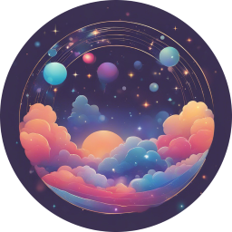
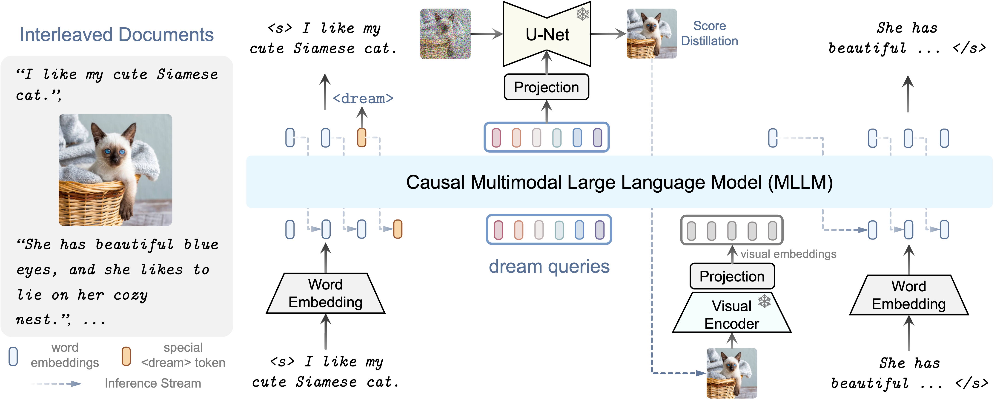

#  DreamLLM

<h3><a href="">DreamLLM: Synergistic Multimodal Comprehension and Creation</a></h3>

[Runpei Dong](https://runpeidong.com/), [Chunrui Han](), [Yuang Peng](https://yuangpeng.com/), [Zekun Qi](https://qizekun.github.io/), [Zheng Ge](https://joker316701882.github.io/), [Jinrong Yang](https://yancie-yjr.github.io/), [Liang Zhao](), [Jianjian Sun](https://scholar.google.com/citations?user=MVZrGkYAAAAJ&hl=en), [Hongyu Zhou](https://scholar.google.com/citations?user=i1PB3cEAAAAJ&hl=en), [Haoran Wei](https://scholar.google.com/citations?user=J4naK0MAAAAJ&hl=en), [Xiangwen Kong](), [Xiangyu Zhang](https://scholar.google.com/citations?user=yuB-cfoAAAAJ&hl=en), [Kaisheng Ma](http://group.iiis.tsinghua.edu.cn/~maks/leader.html) and [Li Yi](https://ericyi.github.io)
	
<a href="https://dreamllm.github.io/"></a>
<a href=""></a> 

DreamLLM is a learning framework that first achieves versatile Multimodal Large Language Models (LLMs) empowered with frequently overlooked synergy between multimodal comprehension and creation. DreamLLM operates on two fundamental principles. The first focuses on the generative modeling of both language and image posteriors by direct sampling in the raw multimodal space. Second, DreamLLM fosters the generation of raw, interleaved documents, modeling both text and image contents, along with unstructured layouts. DreamLLM is a zero-shot multimodal generalist capable of both comprehension and creation.



Code, model weights, and demo will be released soon.


## Contact
If you have any questions related to the code or the paper, feel free to email Runpei Dong (`runpei.dong@gmail.com`).

## License
Our model and weights are licensed for both researchers and commercial entities, upholding the principles of openness. The license is drafted by mofifiction of the license of [LLaMA](https://github.com/facebookresearch/llama).

See the [LICENSE](./LICENSE), as well as our accompanying [Acceptable Use Policy](./USE_POLICY.md).

## Citation

If you find our work useful in your research, please consider citing DreamLLM:
```tex
@article{dong2023dreamllm,
  author = {Dong, Runpei and Han, Chunrui and Peng, Yuang and Qi, Zekun and Ge, Zheng and Yang, Jinrong and Zhao, Liang and Sun, Jianjian and Zhou, Hongyu and Wei, Haoran and Kong, Xiangwen and Zhang, Xiangyu and Ma, Kaisheng and Yi, Li},
  title = {DreamLLM: Synergistic Multimodal Comprehension and Creation},
  journal = {arXiv},
  year = {2023},
}
```
